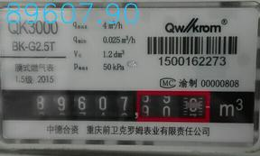
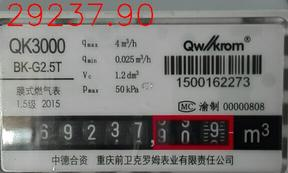

# Multi Digits Recognition with CNN
Multi digits recognition using CNN， Opencv and python. Recognize the five digits on the gas meter, resulting in a final correct rate of 91.61%(131/143). The correct and incorrect results are as follows (resized as 50%):  
 

# Project
```
┌── Network                 Training data and CNN's architecture and wights
│   ├── data
│   └── model
├── RawDataset              143 images 
│   ├── gnd.xls             Ground truth created by create_gndtruth.py
│   └── Images
├── TrainDataset            Single digit image created by create_train_val.py
│   ├── train
│   └── val
├── create_gndtruth.py      Create gnd.xls
├── create_train_val.py     Create Traindata/train and Traindata/val
├── train.py                Train the CNN model
└── recongnition.py         Perform the task

```
Run the recognition.py, you can get the relust saved in result.xls and folder 'Result' which contain correct and incorrect images.

# CNN
The Convolutional Neural Network applied in this project is a LeNet-like network, which consist of two convolution layers and two full connection layers. The network architecture can be found from [this](./model.png). The model is trained by [Keras](https://github.com/fchollet/keras)(2.0.8).

# Dependency
```
    cv2
    keras (2.0.8)
    xlrd
    xlwb
    h5py
    pickle
    numpy
```


